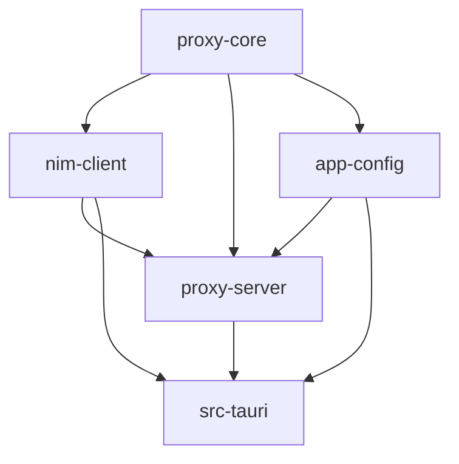

# Architecture

Single source of truth for crate boundaries and dependency rules.
Referenced by [AGENTS.md](AGENTS.md) and [README.md](README.md).

## Workspace layout

```
.
|-- crates/
|   |-- proxy-core/    # protocol types, Anthropic <-> NIM conversion, SSE, tokens, routing
|   |-- nim-client/    # NVIDIA NIM HTTP client + multi-key pool
|   |-- proxy-server/  # Axum-based local Anthropic-compatible server
|   |-- app-config/    # persistent app config (config.json under OS config dir)
|-- src-tauri/         # Tauri commands, window lifecycle, OS integration
|-- src/               # TypeScript frontend (Vite)
```

## Dependency direction



Rules:

- `proxy-core` is the only crate that defines wire types. Everyone else
  imports from it; nobody redefines them.
- `nim-client` may import `proxy-core` but never `proxy-server` or
  `src-tauri`.
- `proxy-server` exposes `start_server(config) -> RunningServer` and never
  reaches up into the Tauri layer.
- `src-tauri` is the only crate that depends on `tauri` and the only place
  for OS-specific code (terminal launching, IDE config writers).
- The frontend talks to Rust exclusively through Tauri commands.

## Configuration

`directories::ProjectDirs::from("dev", "ccnim", "CCNim")` resolves the
config dir. `app_config::AppConfig` writes `config.json`; secrets (auth
token + NIM keys) live in a sibling `secrets.json` with per-user
permissions and never enter the project tree.

## Release profile

Workspace `[profile.release]` is tuned for size:

```
opt-level    = "z"
lto          = "fat"
codegen-units = 1
strip        = "symbols"
panic        = "abort"
```

Tauri bundle target is `nsis` only. Don't add new dependencies without
`default-features = false` where reasonable. Don't regress this profile.

## Refactor rules

- Keep public types in `proxy-core` stable while moving internals.
- Migrations are atomic: update imports to the new owner and delete old
  shims in the same change.
- Cover protocol/runtime moves with focused tests under
  `crates/<crate>/tests/` first.
- CI gate: `cargo fmt --all`, `cargo clippy --workspace --all-targets --
  -D warnings`, `cargo test --workspace`.
